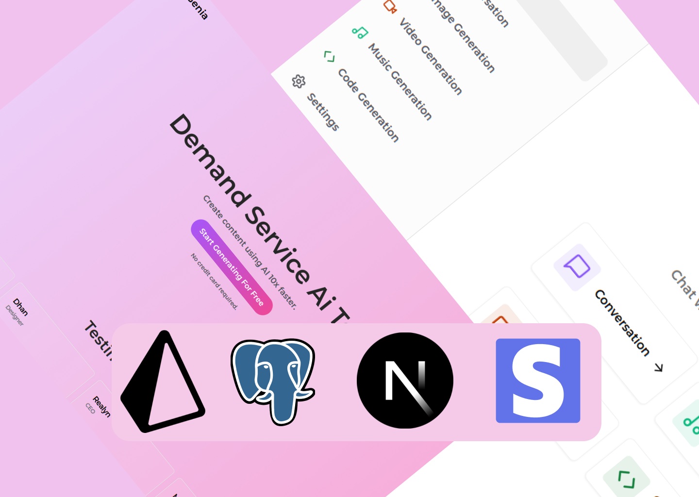

  <p align="center">A progressive <a href="http://nextjs.org" target="_blank">Next.js</a> framework for building efficient and scalable both server-side & client side applications.</p>
    <p align="center">
<a href="" target="_blank"></a>
<a href="" target="_blank"></a>
<a href="" target="_blank"></a>
<a href="" target="_blank"></a>
<a href="" target="_blank"></a>
<a href="" target="_blank"></a>
<a href="" target="_blank"></a>
<a href="" target="_blank"></a>
<a href="" target="_blank"></a>
<a href=""  target="_blank"></a>
</p>


# Build a SaaS AI Platform with Next.js 14, React, Tailwind, Prisma, Stripe

<a href="https://ai-saas-chi-lime.vercel.app/"> Live Demo</a>


This is a repository for Build a SaaS AI Platform with Next.js 13, React, Tailwind, Prisma, Stripe

Features:

- Tailwind design
- Tailwind animations and effects
- Full responsiveness
- Clerk Authentication (Email, Google, 9+ Social Logins)
- Client form validation and handling using react-hook-form
- Server error handling using react-toast
- Image Generation Tool (Open AI)
- Video Generation Tool (Replicate AI)
- Conversation Generation Tool (Open AI)
- Music Generation Tool (Replicate AI)
- Page loading state
- Stripe monthly subscription
- Free tier with API limiting
- How to write POST, DELETE, and GET routes in route handlers (app/api)
- How to fetch data in server react components by directly accessing database (WITHOUT API! like Magic!)
- How to handle relations between Server and Child components!
- How to reuse layouts
- Folder structure in Next 13 App Router


This is a [Next.js](https://nextjs.org/) project bootstrapped with [`create-next-app`](https://github.com/vercel/next.js/tree/canary/packages/create-next-app).

## Getting Started

First, run the development server:

```bash
npm run dev
# or
yarn dev
# or
pnpm dev
# or
bun dev
```

Open [http://localhost:3000](http://localhost:3000) with your browser to see the result.

You can start editing the page by modifying `app/page.tsx`. The page auto-updates as you edit the file.

This project uses [`next/font`](https://nextjs.org/docs/basic-features/font-optimization) to automatically optimize and load Inter, a custom Google Font.

## Learn More

To learn more about Next.js, take a look at the following resources:

- [Next.js Documentation](https://nextjs.org/docs) - learn about Next.js features and API.
- [Learn Next.js](https://nextjs.org/learn) - an interactive Next.js tutorial.

You can check out [the Next.js GitHub repository](https://github.com/vercel/next.js/) - your feedback and contributions are welcome!

## Deploy on Vercel

The easiest way to deploy your Next.js app is to use the [Vercel Platform](https://vercel.com/new?utm_medium=default-template&filter=next.js&utm_source=create-next-app&utm_campaign=create-next-app-readme) from the creators of Next.js.

Check out our [Next.js deployment documentation](https://nextjs.org/docs/deployment) for more details.


### Prerequisites

**Node version 18.x.x**

### Cloning the repository

```shell
git clone https://github.com/dhanubalde/ai-saas.git
```

### Install packages

```shell
npm i
```

### Setup .env file


```js
NEXT_PUBLIC_CLERK_PUBLISHABLE_KEY=
CLERK_SECRET_KEY=

NEXT_PUBLIC_CLERK_SIGN_IN_URL=/sign-in
NEXT_PUBLIC_CLERK_SIGN_UP_URL=/sign-up
NEXT_PUBLIC_CLERK_AFTER_SIGN_IN_URL=/dashboard
NEXT_PUBLIC_CLERK_AFTER_SIGN_UP_URL=/dashboard

OPENAI_API_KEY=
REPLICATE_API_TOKEN=

DATABASE_URL=

STRIPE_API_KEY=
STRIPE_WEBHOOK_SECRET=

NEXT_PUBLIC_APP_URL="http://localhost:3000"
```

### Setup Prisma

Add MySQL Database (I used PlanetScale)

```shell
npx prisma db push

```

### Start the app

```shell
npm run dev
```

## Available commands

Running commands with npm `npm run [command]`

| command         | description                              |
| :-------------- | :--------------------------------------- |
| `dev`           | Starts a development instance of the app |
